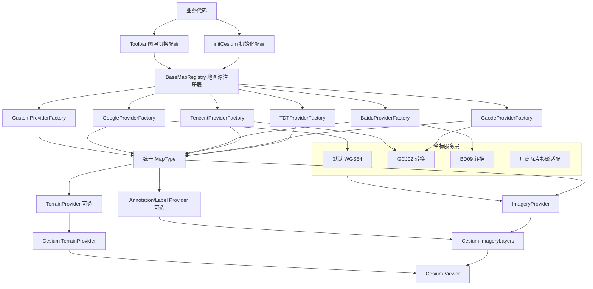

# 多地图厂商接入方案设计与约束说明

## 1. 背景

当前 `vmap-cesium-tool` 1.x 版本的底图能力主要围绕天地图实现：

- 1.x 核心实现以 `src/core/*`、`src/adapters/*` 为主，旧版 `src/libs/*` 仅作为兼容层参考。
- `src/core/types.ts` 中已有 `ProviderType`、`LayersConfig`、`MapType` 等核心类型。
- `src/core/services/toolbar/config.ts` 中已有 `DEFAULT_MAP_TYPES`，当前默认图层来自天地图。
- `src/core/layers/TDTMapLayer.ts`、`GaodeMapLayer.ts`、`BaiduMapLayer.ts`、`CustomMapLayer.ts` 已存在部分地图图层实现。

下一阶段需要支持高德、腾讯、百度、谷歌地图。目标是：业务代码只在初始化时声明地图厂商和鉴权配置，组件内部负责加载对应地图，并保证绘制、取点、覆盖物等业务 API 默认仍使用 Cesium/WGS84 经纬度。

> 本文档面向 1.x 开发落地。AI agent 实施时必须以 1.x 当前目录和类型系统为准，不得照搬 0.x 路径新增一套平行实现。

## 2. 目标

1. 支持以下地图厂商：
   - 天地图
   - 高德地图
   - 腾讯地图
   - 百度地图
   - 谷歌地图
   - 自定义地图源（包含离线地图源）

2. 业务初始化只需要传入地图厂商配置：

```ts
await initCesium('cesiumContainer', {
  baseMap: {
    provider: 'gaode',
    type: 'satellite',
    key: 'xxx',
  },
});
```

3. 业务 API 坐标默认统一为 WGS84：

```ts
map.addMarker({
  longitude: 120.2052342,
  latitude: 30.2489634,
});
```

4. 只有业务 API 显式传入坐标系参数时，组件才进行输入或输出坐标转换：

```ts
map.addMarker({
  longitude: 120.2101,
  latitude: 30.2521,
  coordSystem: 'GCJ02',
});
```

5. 底图厂商坐标、瓦片投影、鉴权、URL 拼接、偏移修正等细节全部由组件内部消化。

6. 支持离线地图模式。离线地图不作为独立厂商，而是归入自定义地图源的 `xyz` 能力。业务只传离线瓦片配置，组件内部完成本地 XYZ 瓦片加载、范围约束、初始定位和工具栏能力裁剪。

## 3. 非目标

1. 不要求业务代码感知底图厂商的底层坐标系。
2. 不要求业务因为切换底图厂商而修改覆盖物坐标。
3. 不要求业务直接拼接或感知厂商瓦片 URL。
4. 高德、百度允许继续使用当前代码中的瓦片 URL，并作为正式 Provider 接入，但 URL 必须集中封装、可替换、可配置，不允许散落在业务代码或多个服务中。
5. 本阶段必须完成百度和 Google Provider。高德、腾讯、百度、谷歌优先实现二维影像/矢量底图；除天地图外，不强制实现三维地形能力。
6. 离线地图不负责业务侧配置保存、表单校验和服务连通性检查。这些仍由业务系统处理。

## 4. 核心设计原则

### 4.1 业务坐标协议固定为 WGS84

组件对外 API 的默认坐标协议固定为 WGS84：

- 添加点、线、面、圆、矩形、模型等覆盖物，默认输入 WGS84。
- 绘制点、线、面完成后的回调，默认输出 WGS84。
- 取点、拾取、测距、测面、相机定位，默认输入/输出 WGS84。
- 搜索结果若来自第三方厂商，需要进入组件前或组件内部转换成 WGS84 后再定位。

地图厂商配置只决定底图来源，不改变业务坐标语义。

### 4.2 底图厂商差异下沉到 Provider 层

高德、腾讯、百度、谷歌之间的差异包括：

- 鉴权参数不同。
- 瓦片 URL 不同。
- 地图类型不同。
- 坐标体系和投影不同。
- 是否需要异步创建 session。
- 是否要求版权展示和配额控制。

这些差异统一收敛在 `ProviderFactory` 和 `ProjectionAdapter` 内部，业务侧不直接处理。

### 4.3 initCesium 与 Toolbar 共用同一套地图源注册表

初始化加载底图和工具栏切换底图必须使用同一套 `BaseMapRegistry`，避免出现：

- 初始化支持某厂商，但工具栏不能切换。
- 工具栏配置与初始化配置不一致。
- 天地图有一套逻辑，其他地图又散落在多个文件里。

## 5. 总体架构



## 6. 建议目录结构

```txt
src/
  core/
    mapProviders/
      registry.ts
      types.ts
      providers/
        tdt.ts
        gaode.ts
        tencent.ts
        baidu.ts
        google.ts
        custom.ts
      coordinates/
        types.ts
        CoordinateService.ts
        transform.ts
        gcj02.ts
        bd09.ts
      tilingSchemes/
        gcj02.ts
        baidu.ts
```

1.x 落地时应优先复用和迁移现有 `src/core/layers/*` 能力，不要直接新建一套与 `src/core/layers` 并行且互不调用的体系。

命名约束：

- 新 API 厂商枚举统一使用 `tdt`、`gaode`、`tencent`、`baidu`、`google`、`custom`。
- 不使用 `tiandi`、`amap` 作为新 API 主枚举。
- 兼容层可以接受旧名称，并映射为新名称：`tiandi -> tdt`、`amap -> gaode`。

## 7. 配置设计

### 7.1 初始化配置

```ts
type BaseMapProviderId =
  | 'tdt'
  | 'gaode'
  | 'tencent'
  | 'baidu'
  | 'google'
  | 'custom';

interface BaseMapRectangle {
  west: number;
  south: number;
  east: number;
  north: number;
}

interface OfflineCameraBoundsConfig {
  enabled?: boolean;
  clamp?: boolean;
  enableTilt?: boolean;
  minimumZoomDistance?: number;
  maximumZoomDistance?: number;
  initialFlyTo?: boolean;
  initialHeight?: number;
}

interface BaseMapConfig {
  provider: BaseMapProviderId;
  type?: string; // custom 下推荐使用 'xyz' | 'wmts' | 'imageryProviders'
  key?: string;
  token?: string;
  ak?: string;
  sk?: string;
  style?: string;
  subdomains?: string[];
  customUrl?: string;
  urlTemplate?: string;
  rectangle?: BaseMapRectangle;
  minimumLevel?: number;
  maximumLevel?: number;
  credit?: string;
  cameraBounds?: OfflineCameraBoundsConfig;
  mode?: 'online' | 'offline';
}

interface MapAuthConfig {
  tdt?: {
    token?: string;
    sk?: string;
  };
  gaode?: {
    key?: string;
  };
  tencent?: {
    key?: string;
  };
  baidu?: {
    ak?: string;
  };
  google?: {
    apiKey?: string;
    mapId?: string;
  };
}

interface InitOptions {
  baseMap?: BaseMapConfig;
  mapAuth?: MapAuthConfig;

  /**
   * 兼容旧版本：
   * mapType: 'tdt'
   * tdtMapTypeId: 'imagery'
   */
  mapType?: string;
  tdtMapTypeId?: string;
  token?: string;
  TD_Token?: string;
  sk?: string;
  TD_SK?: string;
}
```

### 7.2 坐标参数

坐标参数不建议放在初始化配置里改变全局默认值。默认值必须永远是 WGS84。

```ts
type CoordSystem = 'WGS84' | 'GCJ02' | 'BD09';

interface CoordinateAwareInput {
  /**
   * 当前 API 入参坐标系。
   * 不传时默认 WGS84。
   */
  coordSystem?: CoordSystem;
}

interface CoordinateAwareOutput {
  /**
   * 当前 API 回调输出坐标系。
   * 不传时默认 WGS84。
   */
  outputCoordSystem?: CoordSystem;
}
```

示例：

```ts
overlay.addMarker({
  longitude: 120.2052342,
  latitude: 30.2489634,
  // 默认 WGS84，不需要传 coordSystem
});

overlay.addMarker({
  longitude: 120.2101,
  latitude: 30.2521,
  coordSystem: 'GCJ02',
});

drawHelper.drawPoint({
  outputCoordSystem: 'BD09',
  onComplete(point) {
    // point 为 BD09
  },
});
```

### 7.3 自定义 / 离线地图配置

自定义地图源负责承载业务私有 WMTS/XYZ 服务。离线地图是自定义地图源的一个特殊使用场景，统一使用：

```ts
provider: 'custom'
type: 'xyz'
mode: 'offline'
```

这样可以避免 `custom` 与 `offline` 两套 Provider 重复实现，也方便后续将在线私有瓦片、离线瓦片、内网 WMTS 统一到同一个自定义 Provider 工厂中。

```ts
await initCesium('cesiumContainer', {
  baseMap: {
    provider: 'custom',
    type: 'xyz',
    mode: 'offline',
    urlTemplate: 'https://example.com/static-resource/tiles/yuhang/{z}/{x}/{y}.png',
    rectangle: {
      west: 118,
      south: 29,
      east: 123,
      north: 33,
    },
    minimumLevel: 10,
    maximumLevel: 18,
    credit: '本地瓦片',
    cameraBounds: {
      enabled: true,
      clamp: true,
      enableTilt: false,
      initialFlyTo: true,
      initialHeight: 150000,
    },
  },
});
```

自定义地图源类型：

- `type: 'xyz'`：通过 `Cesium.UrlTemplateImageryProvider` 加载 `{z}/{x}/{y}` 瓦片。
- `type: 'wmts'`：通过 `Cesium.WebMapTileServiceImageryProvider` 加载 WMTS 服务。
- `type: 'imageryProviders'`：业务直接传入 `Cesium.ImageryProvider[]`，用于高级场景。

离线模式约束：

- `urlTemplate` 必填，默认支持 `{z}`、`{x}`、`{y}` 占位符。
- `rectangle` 必填，用于限定离线瓦片覆盖范围和相机活动范围。
- 默认使用 `Cesium.WebMercatorTilingScheme`。
- 默认 `minimumLevel = 0`，`maximumLevel = 18`。
- 默认 `credit = '本地瓦片'`。
- `mode === 'offline'` 时，`cameraBounds.enabled !== false`，组件需要限制相机在 `rectangle` 内。
- `mode === 'offline'` 且 `cameraBounds.enableTilt === false` 时，组件禁用倾斜，适配常规二维离线瓦片。
- 离线地图加载失败时，应给出明确错误，不应回退到在线底图，避免私有化场景误访问外网。

## 8. MapType 与 ProviderFactory 设计

现有 `MapType.provider(token, sk)` 只适合天地图。建议升级为上下文模式，并支持异步 provider。

```ts
interface MapProviderContext {
  viewer?: Cesium.Viewer;
  baseMap: BaseMapConfig;
  auth?: MapAuthConfig;
}

interface MapType {
  id: string;
  providerId: BaseMapProviderId;
  name: string;
  nameKey?: string;
  thumbnail: string;

  provider: (
    context: MapProviderContext
  ) => Cesium.ImageryProvider[] | Promise<Cesium.ImageryProvider[]>;

  terrainProvider?: (
    context: MapProviderContext
  ) => Cesium.TerrainProvider | null | Promise<Cesium.TerrainProvider | null>;

  annotationProvider?: (
    context: MapProviderContext
  ) => Cesium.ImageryProvider | null | Promise<Cesium.ImageryProvider | null>;

  forcePlaceName?: boolean;
  placeNameLabel?: string;
  placeNameLabelKey?: string;
}

interface BaseMapProviderFactory {
  providerId: BaseMapProviderId;
  createMapTypes(config: BaseMapConfig, auth?: MapAuthConfig): MapType[];
}
```

Google Map Tiles API 等场景需要先创建 session，再请求 tile，因此 `provider` 必须允许返回 `Promise`。

异步约束：

- `initCesium` 和工具栏图层切换都必须支持异步 `provider`。
- 图层切换必须使用 `requestId`、`version` 或等价机制处理竞态。
- 如果用户快速切换底图，过期异步请求返回后不得覆盖当前 Viewer 图层。
- Provider 加载失败时不得直接清空已有可用底图，应保留上一张可用底图或回退到明确 fallback。

## 9. 坐标处理设计

### 9.1 对外默认行为

所有业务 API 默认 WGS84：

```ts
const DEFAULT_COORD_SYSTEM: CoordSystem = 'WGS84';
```

对外输入流程：

```txt
业务输入经纬度
  -> 读取 options.coordSystem，默认 WGS84
  -> CoordinateService.toWGS84()
  -> Cesium.Cartesian3.fromDegrees()
  -> 添加到 Viewer
```

对外输出流程：

```txt
Cesium 拾取 Cartesian3
  -> 转为 WGS84 经纬度
  -> 读取 options.outputCoordSystem，默认 WGS84
  -> CoordinateService.fromWGS84()
  -> 回调业务
```

### 9.2 CoordinateService

```ts
interface LngLat {
  longitude: number;
  latitude: number;
  height?: number;
}

class CoordinateService {
  toWGS84(point: LngLat, source: CoordSystem = 'WGS84'): LngLat;

  fromWGS84(point: LngLat, target: CoordSystem = 'WGS84'): LngLat;

  transform(point: LngLat, source: CoordSystem, target: CoordSystem): LngLat;

  transformGeometry<T>(geometry: T, source: CoordSystem, target: CoordSystem): T;
}
```

### 9.3 必须接入坐标服务的能力

以下入口必须统一接入 `CoordinateService`：

- `setCameraView`
- `setCameraFlyTo`
- 点覆盖物
- 线覆盖物
- 面覆盖物
- 圆覆盖物
- 矩形覆盖物
- Label / Billboard / Model
- 绘制点、线、面完成回调
- 地图点击取点
- 测距、测面结果中的点位输出
- 搜索结果定位
- GeoJSON / 数据源加载前的坐标转换，若 API 支持指定坐标系

### 9.4 底图瓦片偏移不能靠业务坐标转换解决

高德、腾讯、百度底图的坐标体系与 Cesium 默认 WGS84/WebMercator 存在差异。即使覆盖物全部使用 WGS84，如果底图 provider 没有处理瓦片偏移，视觉上仍可能错位。

因此必须同时解决两件事：

1. 业务 API 边界上的坐标转换。
2. 厂商底图 provider 内部的瓦片投影/偏移适配。

不要用“把业务覆盖物坐标全部转成 GCJ02/BD09”的方式解决底图错位问题。这样会破坏组件统一 WGS84 的对外协议。

## 10. 各厂商约束

### 10.1 天地图

- 现有实现可保留。
- 支持普通图、影像图、地形图、三维图。
- 三维地形和三维路网依赖 `tdt-terrain-cesium-plugin`。
- 鉴权参数包括 `token` 和可选 `sk`。
- 新 API 枚举使用 `tdt`。
- 建议迁入 `TDTProviderFactory`，但保持旧 API 兼容。

### 10.2 高德地图

- 国内地图通常涉及 GCJ02 坐标体系。
- 接入时需要在 provider 内部处理瓦片偏移或投影适配。
- 业务覆盖物仍默认 WGS84，不随高德底图改变。
- 新 API 枚举使用 `gaode`。
- 允许继续使用当前 `src/core/layers/GaodeMapLayer.ts` 中的高德瓦片 URL 作为正式 Provider 的默认实现。
- 现有 URL 必须集中封装在 Provider 层，不允许在业务 API、Toolbar 或 Overlay/Draw 服务中重复拼接。
- 需要保留 `key/token` 配置入口，即使当前 URL 暂未使用 key，也不得删除鉴权字段。

### 10.3 腾讯地图

- 与高德类似，通常涉及 GCJ02 坐标体系。
- provider 内部处理瓦片偏移或投影适配。
- 需要确认所使用接口是否允许作为 Cesium 底图瓦片服务。
- 业务 API 不暴露腾讯坐标作为默认坐标。

### 10.4 百度地图

- 百度使用 BD09 以及百度墨卡托体系，复杂度最高。
- 不建议直接复用普通 WebMercator 逻辑。
- 建议单独实现 `BaiduTilingScheme` 或 `BaiduProjectionAdapter`。
- 本阶段必须完成百度 Provider，不可仅预留接口。
- 允许继续使用当前 `src/core/layers/BaiduMapLayer.ts` 中的百度瓦片 URL 作为正式 Provider 的默认实现。
- 现有 URL 必须集中封装在 Provider 层，不允许在业务 API、Toolbar 或 Overlay/Draw 服务中重复拼接。
- 必须单独做视觉对齐验收，不能只验证“能出图”。

### 10.5 谷歌地图

- 建议使用官方 Map Tiles API。
- 本阶段必须完成 Google Provider，不可仅预留接口。
- 2D Tiles 必须通过官方 Map Tiles API 创建 session token 后请求瓦片。
- 需要处理 API key、session token、计费、配额、错误提示和版权展示。
- 必须提供 Google logo/attribution 展示策略，不能继续无条件隐藏 Cesium credit。
- provider 创建可能是异步过程，因此 `MapType.provider` 必须支持 Promise。
- 需要考虑国内网络环境可访问性。

### 10.6 自定义地图源

自定义地图源用于业务私有 WMTS/XYZ 服务：

```ts
await initCesium('map', {
  baseMap: {
    provider: 'custom',
    type: 'xyz',
    urlTemplate: 'https://example.com/tiles/{z}/{x}/{y}.png',
  },
});
```

自定义地图默认按 WGS84/WebMercator 处理。若存在特殊投影，需要业务显式声明并由组件提供对应 adapter。

#### 10.6.1 离线地图模式

离线地图用于私有化部署场景，本质是 `custom` Provider 的 `xyz + offline` 模式：

组件应下沉当前业务侧 `LOCAL_TILES_CONFIG` 和 `applyLocalTiles` 中的通用能力：

- 根据 `urlTemplate` 创建 `Cesium.UrlTemplateImageryProvider`。
- 根据 `rectangle` 创建 `Cesium.Rectangle.fromDegrees(...)` 并传给 provider。
- 支持 `minimumLevel`、`maximumLevel`、`credit`。
- 支持清空或替换当前底图图层。
- 支持 `cameraBounds`：
  - 设置 `viewer.scene.globe.cartographicLimitRectangle`。
  - 设置 `screenSpaceCameraController.minimumZoomDistance`。
  - 设置 `screenSpaceCameraController.maximumZoomDistance`。
  - 根据配置禁用倾斜。
  - 在 `camera.moveEnd` 和必要的 render hook 中保证相机不越界。
  - Provider 销毁或底图切换时必须清理监听器，并恢复被修改的相机/Globe 状态。
- 支持 `initialFlyTo`：
  - 优先使用业务传入的初始中心。
  - 初始中心超出 `rectangle` 时自动 clamp 到范围内。
  - 未传初始中心时使用 `rectangle` 中心点。

离线地图模式下，工具栏能力必须裁剪：

- 隐藏或禁用搜索按钮。
- 隐藏或禁用图层切换按钮。
- 保留测量、2D/3D、定位、缩放、全屏等其他能力，除非业务显式配置禁用。

业务侧仍然负责：

- 获取离线地图配置接口。
- 保存离线地图配置。
- 离线地图 URL 连通性检查。
- 将业务枚举如 `Privatization` 映射为组件配置 `provider: 'custom'`、`type: 'xyz'`、`mode: 'offline'`。

## 11. 兼容策略

现有 API 必须继续可用：

```ts
await initCesium('cesiumContainer', {
  mapType: 'tdt',
  tdtMapTypeId: 'imagery',
  token: 'xxx',
  sk: 'xxx',
});
```

内部转换为：

```ts
{
  baseMap: {
    provider: 'tdt',
    type: 'imagery',
    token: 'xxx',
    sk: 'xxx',
  }
}
```

`CesiumMapToolbar.setTDToken()`、`setTDSK()`、`setTDTAuth()` 继续保留，但后续建议新增通用接口：

```ts
toolbar.setMapAuth({
  tdt: { token: 'xxx', sk: 'xxx' },
  gaode: { key: 'xxx' },
});

toolbar.setBaseMapProvider('gaode');
```

### 11.1 CesiumMapMark 迁移兼容

0.x 中存在 `src/libs/CesiumMapMark.ts`，它不是单纯的点标记工具，而是一个“标绘工作台”：

- 点、线、面、矩形、圆绘制。
- 作业区 / 禁飞区绘制。
- 标绘工具条。
- 颜色预设与不同图形颜色配置。
- 绘制开始、绘制结束、删除、清空、编辑变化、编辑结束等回调。
- 点位单独绘制和拖拽编辑。
- 面、线、圆等实体编辑。
- 标绘结果导出。
- 与 `CesiumOverlayService`、`CesiumMapDraw`、`PickGovernor` 等能力协作。

该能力可以迁移到 1.x，但不应直接把 0.x 的 `CesiumMapMark.ts` 原样复制到 1.x。1.x 已经有更清晰的分层：

- `src/core/services/draw/DrawService.ts`
- `src/core/services/overlay/OverlayService.ts`
- `src/core/services/toolbar/ToolbarService.ts`
- `src/adapters/*`
- `src/core/entities/*`

推荐迁移方式：

```txt
src/
  core/
    services/
      mark/
        MarkService.ts
        MarkToolbar.ts
        markTypes.ts
        markDefaults.ts
        markResult.ts
        index.ts
  adapters/
    MapMarkAdapter.ts
```

#### 11.1.1 MarkService 职责

`MarkService` 是 1.x 的新标绘服务，内部组合已有能力：

- 使用 `DrawService` 负责点、线、面、矩形、圆的交互绘制。
- 使用 `OverlayService` 负责可编辑覆盖物、删除、清空、查询、导出。
- 使用 `MarkToolbar` 负责标绘工具条 UI。
- 使用坐标服务保证业务 API 默认输入/输出 WGS84。
- 使用 `PickGovernor` 或等价节流策略处理 pick/edit 高频事件。

`MarkService` 不应重复实现一套和 `DrawService` 平行的绘制引擎。

#### 11.1.2 对外 API

建议保留 0.x 的主要语义：

```ts
type MarkDrawType = 'point' | 'polyline' | 'polygon' | 'rectangle' | 'circle';
type MarkWorkAreaType = 'polygon' | 'circle' | 'rectangle';
type MarkWorkAreaKind = 'work' | 'noFly';

interface MarkService {
  startDrawing(type: MarkDrawType, options?: MarkDrawOptions): void;
  drawPoint(options?: MarkDrawOptions): void;
  drawPolyline(options?: MarkDrawOptions): void;
  drawPolygon(options?: MarkDrawOptions): void;
  drawRectangle(options?: MarkDrawOptions): void;
  drawCircle(options?: MarkDrawOptions): void;

  startWorkAreaDraw(type: MarkWorkAreaType, kind?: MarkWorkAreaKind, options?: MarkDrawOptions): void;
  stopDraw(): void;
  cancelDrawing(): void;

  clearAll(): void;
  deleteEntity(entity: Cesium.Entity | string): void;

  enableEdit(options?: MarkEditOptions): void;
  disableEdit(): MarkDrawResult | null;
  startEdit(entityOrId: Cesium.Entity | string, options?: MarkEditOptions): boolean;
  stopEdit(): MarkDrawResult | null;

  setColor(type: MarkDrawType, color: string): void;
  getColor(type: MarkDrawType): string;

  getEntities(): Cesium.Entity[];
  exportData(): MarkExportItem[];
  destroy(): void;
}
```

#### 11.1.3 兼容 Adapter

为了减少业务迁移成本，1.x 应提供兼容导出：

```ts
export { MapMarkAdapter as CesiumMapMark } from './adapters/MapMarkAdapter';
export type {
  MarkDrawType as CesiumMapDrawType,
  MarkDrawResult as CesiumMapDrawResult,
  MarkOptions as CesiumMapMarkOptions,
  MarkCallbacks as CesiumMapMarkCallbacks,
} from './core/services/mark';
```

兼容层职责：

- 支持 0.x 构造函数参数顺序。
- 将 0.x 的 `CesiumMapMarkOptions` 映射为 1.x `MarkServiceOptions`。
- 将 0.x 回调名称映射为 1.x 回调。
- 保留 `drawPoint/drawPolyline/drawPolygon/drawRectangle/drawCircle` 等方法。
- 保留 `exportData()` 结果结构，字段名尽量兼容。

#### 11.1.4 坐标约束

`CesiumMapMark` 迁移后必须遵守统一坐标协议：

- 绘制结果默认输出 WGS84。
- `exportData()` 默认输出 WGS84。
- `startDrawing()`、`startWorkAreaDraw()` 支持 `outputCoordSystem`，但不改变全局默认值。
- 编辑后的 `onEditEnd` 默认输出 WGS84。
- 高度值必须保持，不得在 GCJ02/BD09 转换中丢失。

#### 11.1.5 工具条约束

0.x 的 `CesiumMapMark` 自带标绘工具条，1.x 可继续提供，但必须独立于主 `ToolbarService`：

- 标绘工具条只负责标绘按钮，不应混入搜索、图层切换、测量等主工具栏能力。
- 支持 `showToolbar: false`，允许业务只使用 API 不使用 UI。
- 支持 `toolbarPosition`、`buttonSize`、`buttonSpacing`、`zIndex`。
- 支持默认按钮：点、线、面、圆；矩形可通过配置启用。
- 支持颜色预设和每种图形独立颜色。

#### 11.1.6 生命周期约束

迁移时必须处理以下清理逻辑：

- 销毁 draw interaction handler。
- 销毁 edit click/move/down/up handler。
- 清理点编辑 marker。
- 恢复拖拽编辑期间修改过的 camera controller 状态。
- 恢复因编辑而临时修改的 `requestRenderMode`。
- 移除工具条 DOM 和颜色面板 DOM。
- 清理 DrawService 和 OverlayService 中的标绘实体。

#### 11.1.7 与多地图 Provider 的关系

`MarkService` 不感知底图厂商。无论当前底图是 `tdt`、`gaode`、`baidu`、`google` 还是 `custom + xyz + offline`：

- 标绘 API 默认 WGS84。
- 标绘结果默认 WGS84。
- 底图偏移由 Provider 层负责。
- 离线地图模式下仍允许标绘，但如果相机被限制在离线瓦片范围内，标绘点位也应受当前 pick 结果约束。

## 12. 开发步骤建议

### 12.0 AI Agent 开发硬约束

将本文档作为 AI agent 提示词使用时，必须同时遵守以下约束：

1. 以 1.x 当前架构为准：优先修改 `src/core/*`、`src/adapters/*`、`src/core/services/toolbar/*`，不要照 0.x 路径新增重复实现。
2. 开发前必须先盘点现有 `MapType`、`ProviderType`、`LayersConfig`、`MapPluginOptions`、Toolbar 默认图层和已有 `TDT/Gaode/Baidu/Custom` 图层实现。
3. 厂商枚举统一使用 `tdt`、`gaode`、`tencent`、`baidu`、`google`、`custom`。旧名称只允许在兼容层映射，不允许成为新 API 主枚举；离线地图不得新增独立 provider 枚举，应使用 `custom + xyz + offline`。
4. 高德和百度允许继续使用当前代码中的瓦片 URL，并作为正式 Provider 默认实现；但 URL 必须集中封装在 Provider 层，不能散落到业务 API、Toolbar、Overlay 或 Draw 服务。
5. 百度和 Google 必须完成可用 Provider，不允许只添加类型、接口或 TODO。
6. 坐标默认协议不可变：所有业务 API 默认输入/输出 WGS84；不得因为底图厂商改变全局坐标默认值。
7. `coordSystem` 和 `outputCoordSystem` 只能作为单次 API 调用参数，不能作为初始化全局默认坐标系。
8. 坐标改造必须覆盖所有 `fromDegrees`、`fromCartesian`、`Rectangle.fromDegrees`、GeoJSON 坐标加载、搜索定位、绘制回调、覆盖物适配器和相机定位入口。
9. GCJ02/BD09 转换必须保证高度不变；中国境外坐标必须定义明确策略，默认不做 GCJ02 偏移。
10. 底图瓦片偏移必须在 Provider/TilingScheme 层解决，不允许通过把业务覆盖物默认转成 GCJ02/BD09 来“对齐”底图。
11. `MapType.provider` 若改为异步，所有调用点必须支持 Promise，并处理快速切换图层的过期请求覆盖问题。
12. 图层切换失败时不得清空现有可用底图；应保留上一张可用底图或回退到明确 fallback。
13. 第三方地图版权展示不能继续无条件隐藏 Cesium credit；必须提供 credit/attribution 展示策略。
14. 测试不得依赖真实外部地图网络请求；Provider 单测应 mock Cesium provider、URL 构造、Google session 请求。
15. 不做无关重构，不删除旧 API；旧 API 只能标记 deprecated 并通过适配层转换到新配置。
16. 离线地图模式必须下沉到组件 `custom` Provider 层，不允许业务侧继续直接调用 `viewer.imageryLayers.removeAll()` 或直接创建 `UrlTemplateImageryProvider`。
17. 离线地图模式必须自动裁剪工具栏：搜索和图层切换不可见或不可用。
18. 离线地图切换到其他底图时必须清理相机边界、moveEnd/preRender 监听和 `cartographicLimitRectangle`。
19. `CesiumMapMark` 迁移不得原样复制 0.x 单体实现；必须组合 1.x 的 `DrawService`、`OverlayService`、实体体系和 Adapter 兼容层。
20. `CesiumMapMark` 兼容导出必须保留主要 0.x API 语义，业务可逐步迁移到新的 `MarkService`。

### 阶段一：抽象与兼容

1. 先盘点并复用 `src/core/types.ts`、`src/core/layers/*`、`src/core/services/toolbar/config.ts`、`src/adapters/*`。
2. 新增或迁移统一地图源注册表，优先放在 `src/core/mapProviders/registry.ts`。
3. 将现有天地图默认图层迁入 `TDTProviderFactory` 或通过 adapter 接入注册表。
4. 改造 `initCesium`，优先识别 `baseMap`，同时兼容旧的 `mapType/tdtMapTypeId`。
5. 改造 `MapLayersService`，支持异步 `mapType.provider(context)`。
6. 保证天地图现有能力无回归。

### 阶段二：坐标服务

1. 新增 `CoordinateService`。
2. 实现 WGS84、GCJ02、BD09 互转。
3. 覆盖添加覆盖物、绘制回调、取点、相机定位。
4. 所有 API 默认 WGS84。
5. 只有显式传 `coordSystem/outputCoordSystem` 时才转换。

### 阶段三：新增厂商 Provider

1. 高德：实现普通图、影像图、标注图。
2. 腾讯：实现普通图、影像图、标注图。
3. 百度：必须完成基础图层和百度投影适配。
4. Google：必须完成官方 Map Tiles API session 管理和 provider。
5. 自定义：支持 XYZ/WMTS 基础模板。
6. 自定义地图：支持在线/离线 XYZ、WMTS、业务自定义 ImageryProvider；离线模式支持范围限制、初始定位和工具栏裁剪。

### 阶段四：验收与文档

1. 增加示例页面。
2. 增加 API 文档。
3. 增加每个厂商的鉴权说明。
4. 增加坐标默认规则说明。
5. 增加视觉对齐测试点。

### 阶段五：CesiumMapMark 迁移

1. 新增 `src/core/services/mark/*`。
2. 基于 `DrawService` 和 `OverlayService` 实现 `MarkService`。
3. 新增 `src/adapters/MapMarkAdapter.ts`，兼容 0.x `CesiumMapMark` 构造参数和主要方法。
4. 导出 `CesiumMapMark` 兼容类和新的 `MarkService` 类型。
5. 增加点、线、面、矩形、圆、作业区/禁飞区标绘示例。
6. 增加编辑、删除、清空、颜色切换、导出数据的验收用例。

## 13. 验收标准

### 13.1 功能验收

- 初始化可通过 `baseMap.provider` 加载不同厂商底图。
- 工具栏可切换不同厂商或不同地图类型。
- 天地图旧 API 继续可用。
- 高德、腾讯、百度、谷歌底图加载失败时有明确错误提示或降级策略。
- 离线地图加载失败时有明确错误提示，且不自动访问在线底图。
- Google 异步 session 不阻塞 Viewer 初始化异常。

### 13.2 坐标验收

使用同一组 WGS84 测试坐标，在不同厂商底图下：

- 添加点位位置应与真实地物对齐。
- 绘制点回调默认返回 WGS84。
- 地图点击取点默认返回 WGS84。
- `coordSystem: 'GCJ02'` 输入时，覆盖物能正确落到对应 WGS84 位置。
- `outputCoordSystem: 'BD09'` 输出时，回调坐标为 BD09。
- 离线地图模式下，添加 WGS84 点位和绘制取点仍默认使用 WGS84。

建议准备固定测试点：

```txt
杭州西湖
WGS84: 120.148915, 30.235901

北京天安门
WGS84: 116.3912757, 39.906217

上海东方明珠
WGS84: 121.499718, 31.239703
```

### 13.3 回归验收

- 现有天地图普通图、影像图、地形图、三维图正常。
- 三维天地图地形和路网开关正常。
- 绘制、测量、覆盖物、禁飞区、搜索功能不因底图抽象改造回退。
- 离线地图模式下搜索和图层切换入口不可见或不可用。
- 从离线地图切回在线地图后，相机范围限制和监听器已被清理。

## 14. 风险与约束

1. 厂商瓦片接口合规风险  
   不应默认使用未公开、未授权或不稳定的瓦片地址。需要在开发前确认商用授权与服务条款。

2. 坐标错位风险  
   高德、腾讯、百度必须做底图 provider 层的投影/偏移适配。只做业务坐标转换是不够的。

3. 百度复杂度较高  
   百度 BD09 / 百度墨卡托与 Cesium 默认体系差异较大，建议单独排期和验收。

4. Google 网络与计费风险  
   Google Map Tiles API 涉及 API key、session、计费、配额、版权展示，以及国内网络可访问性。

5. 异步 provider 改造影响面  
   `MapLayersService.switchMapType()` 和 `initCesium()` 都需要支持异步 provider，注意切换竞态和错误恢复。

6. 版权展示约束  
   当前代码隐藏了 Cesium credit 容器。接入第三方商业地图时，必须重新评估各厂商版权展示要求。

## 15. 结论

本次改造的关键不是简单增加几组瓦片 URL，而是建立一套稳定的多地图源架构：

- 业务初始化只传地图厂商。
- 业务 API 坐标默认永远是 WGS84。
- 厂商坐标、瓦片投影、鉴权、session、版权等差异全部下沉到 provider 层。
- `initCesium` 和 `CesiumMapToolbar` 共用同一套地图源注册表。
- 旧版天地图 API 保持兼容。

按照该方案推进后，后续新增地图厂商或私有地图服务时，只需要新增一个 provider factory，而不需要修改绘制、覆盖物、测量、取点等业务能力。

## 16. 参考资料

- Google Map Tiles API Overview: <https://developers.google.com/maps/documentation/tile/overview>
- Google Map Tiles API Session Tokens: <https://developers.google.com/maps/documentation/tile/session_tokens>
- Google 2D Tiles Overview: <https://developers.google.com/maps/documentation/tile/2d-tiles-overview>
- Google Maps Platform Service Specific Terms: <https://cloud.google.com/maps-platform/terms/maps-service-terms>
